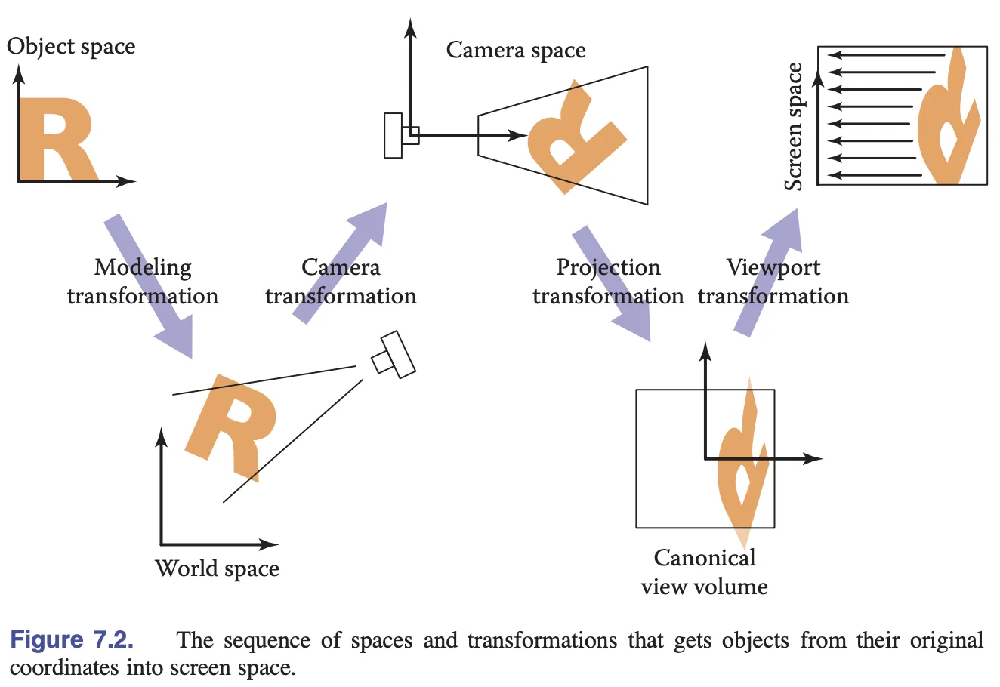

# Camera

Moving the camera performs better in implementation than rotating all objects in viewpoint. Given that we are working on a 2D plane, we are only concerned with XY axes.

If we want the canvas to move to the left, the corresponding camera movement is to pan to the right.



## Understand the matrix
- World transform: the actual world position of camera and how it moves 
- Inverse of camera/world transformation [viewMatrix]: a camera movement should be opposite to the movement of the objects in the world
- Projection matrix: the screen transformation that converts view space to clip space
- View projection matrix: combination of `viewMatrix` and `projectionMatrix`
- View projection matrix inverse: used for mouse/touch coordinate conversion

## Projection transformation
This is the transformation from pixel space to clip space.

```glsl
// Pixel space to [0, 1] (Screen space)
vec2 zeroToOne = position / u_Resolution;

// Convert from [0, 1] to [0, 2]
vec2 zeroToTwo = zeroToOne * 2.0;

// Convert from [0, 2] to [-1, 1] (NDC/clip space)
vec2 clipSpace = zeroToTwo - 1.0;

// Flip Y axis
gl_Position = vec4(clipSpace * vec2(1, -1), 0.0, 1.0);
```

Alternatively, this can be streamlined:
```glsl
layout(std140) uniform SceneUniforms {
    mat3 u_ProjectionMatrix;
};

gl_Position = vec4((u_ProjectionMatrix
    * u_ModelMatrix
    * vec3(position, 1)).xy, 0, 1);
```

This can be abstracted away by `projection` method provided by gl-matrix.

```ts
export class Camera {
    #projectionMatrix = mat3.create();

    get projectionMatrix() {
        return this.#projectionMatrix;
    }

    projection(width: number, height: number) {
        mat3.projection(this.#projectionMatrix, width, height);
    }
}
```

`projectionMatrix` can't be passed directly because of the alignment issue of the buffer bytes, padding should be added to the mat3 first before passing off to the shader.

## Camera transformation
Camera transformation can be represented by matrices. Without a specific matrix added to the shader to manage the transformation, when you want to represent a camera movement, you need to update EVERY object's transform values.

```glsl
layout(std140) uniform SceneUniforms {
    mat3 u_ProjectionMatrix;
    mat3 u_ViewMatrix;
};

gl_Position = vec4((u_ProjectionMatrix
    * u_ViewMatrix
    * u_ModelMatrix
    * vec3(position, 1)).xy, 0, 1);
```
Doing this means that a single transform is needed: `camera.x += 100` would move every object in respect of the camera.

The camera transformation matrix should be the **inverse** of the camera's transformation in world coordinate system. This is due to the camera movement being the opposite of the scene movement.

Other matrices that are useful are the viewProjection matrix and the inverse.

## Add camera as a plugin
Convert the coordinates contained in the mouse event object from canvas properties to clip space coordinates:

```ts
function getClipSpaceMousePosition(e: MouseEvent): vec2 {
    // CSS space
    const rect = canvas.getBoundingClientRect();
    const cssX = e.clientX - rect.left;
    const cssY = e.clientY - rect.top;

    // Normalize to [0, 1]
    const normalizedX = cssX / canvas.clientWidth;
    const normalizedY = cssY / canvas.clientHeight;

    // Convert to clipspace
    const clipX = normalizedX * 2 - 1;
    const clipY = normalizedY * -2 + 1;

    return [clipX, clipY];
}
```

```ts
canvas.addEventListener('mousedown', (e) => {
    e.preventDefault();
    window.addEventListener('mousemove', handleMouseMove);
    window.addEventListener('mouseup', handleMouseUp);

    // the invert matrix of vp matrix
    mat3.copy(startInvertViewProjectionMatrix, camera.viewProjectionMatrixInv);
    // camera postion in world space
    startCameraX = camera.x;
    startCameraY = camera.y;
    // convert mouse position to world space
    startPos = vec2.transformMat3(
        startPos,
        getClipSpaceMousePosition(e),
        startInvViewProjMatrix,
    );
});
```
We need to track `startInvViewProjMatrix`, `startCameraX`, `startCameraY` and `startPos`. 

`startPos` is the current mouse position in world space - transform the coords in NDC with the inverse of the camera's projection matrix.

```ts
function handleMouseMove(e: MouseEvent) {
    moveCamera(e);
}

function moveCamera(e: MouseEvent) {
    const pos = vec2.transformMat3(
        vec2.create(),
        getClipSpaceMousePosition(e),
        startInvertViewProjectionMatrix,
    );

    camera.x = startCameraX + startPos[0] - pos[0];
    camera.y = startCameraY + startPos[1] - pos[1];
}
```

## Rotation
This implementation uses a shift key to enable rotation:
```ts
canvas.addEventListener('mousedown', (e) => {
    rotate = e.shiftKey;
});

function handleMouseMove(e: MouseEvent) {
    if (rotate) {
        rotateCamera(e);
    } else {
        moveCamera(e);
    }
}
```

This particular implemntation uses the mouse starting point as the origin and the horizontal distance moved by the mouse is taken as the angle of rotation.

```ts
function rotateCamera(e: MouseEvent) {
    // convert moved distance to ratation
    const delta = (e.clientX - startMousePos[0]) / 100;

    // create matrix with pivot
    const camMat = mat3.create();
    mat3.translate(camMat, camMat, [startPos[0], startPos[1]]);
    mat3.rotate(camMat, camMat, delta);
    mat3.translate(camMat, camMat, [-startPos[0], -startPos[1]]);

    // apply transformation
    camera.x = startCameraX;
    camera.y = startCameraY;
    camera.rotation = startCameraRotation;
    mat3.multiply(camMat, camMat, camera.matrix);

    // Reset camera params
    camera.x = camMat[6];
    camera.y = camMat[7];
    camera.rotation = startCameraRotation + delta;
}
```

## Zoom
To zoom, you need to track the origin as well, which would be the position of the mouse.

```js
canvas.addEventListener('wheel', (e) => {
    e.preventDefault();
    const position = getClipSpaceMousePosition(e);

    // mouse position in world space before zooming
    const [preZoomX, preZoomY] = vec2.transformMat3(
        vec2.create(),
        position,
        camera.viewProjectionMatrixInv,
    );

    // calculate zoom factor
    const newZoom = camera.zoom * Math.pow(2, e.deltaY * -0.01);
    camera.zoom = Math.max(MIN_ZOOM, Math.min(MAX_ZOOM, newZoom));

    // mouse position in world space after zooming
    const [postZoomX, postZoomY] = vec2.transformMat3(
        vec2.create(),
        position,
        camera.viewProjectionMatrixInv,
    );

    // move camera
    camera.x += preZoomX - postZoomX;
    camera.y += preZoomY - postZoomY;
});
```

## Camera animation
1. Using `Mapbox`, create a `LandMark` to track the current state of the camera, and also set parameters such as position, rotation angle, and scale.
2. Create a camera transition by creating a target `Landmark` through a smooth transition.

```ts
export interface Landmark {
    zoom: number;
    x: number;
    y: number;
    rotation: number;
}

export class Camera {
    createLandmark(params: Partial<Landmark>): Landmark {
        return {
            zoom: this.#zoom,
            x: this.#x,
            y: this.#y,
            rotation: this.#rotation,
            ...params,
        };
    }
}
```
## Animation effects
Add options to skip animation by passing in 0 as `duration`.
Add `onframe` and `onfinish` properties to include callbacks for per frame and on end actions.

You also have to make sure that any outstanding animations will be ended prematurely if there are new animations incoming.
```ts
this.cancelLandmarkAnimation(); // cancel outstanding animation first

let timeStart: number | undefined;
const destPosition: vec2 = [x, y];
const destZoomRotation: vec2 = [zoom, rotation];
const animate = (timestamp: number) => {
    if (timeStart === undefined) {
        timeStart = timestamp;
    }
    const elapsed = timestamp - timeStart;
    if (elapsed > duration) {
        endAnimation();
        return;
    }

    // Omit calculation for now.

    if (elapsed < duration) {
        if (onframe) {
        onframe(t);
        }
        this.#landmarkAnimationID = requestAnimationFrame(animate);
    }
};
requestAnimationFrame(animate);
```

As part of the animation calculation, `lerp` is used to interpolate the camera's current position.

The approach also does a mini-optimization by ending the animation process earlier once the minimum distance is breached.
```ts
const dist = vec2.dist(interPosition, destPosition);
if (dist <= EPSILON) {
    endAnimation();
    return;
}
```