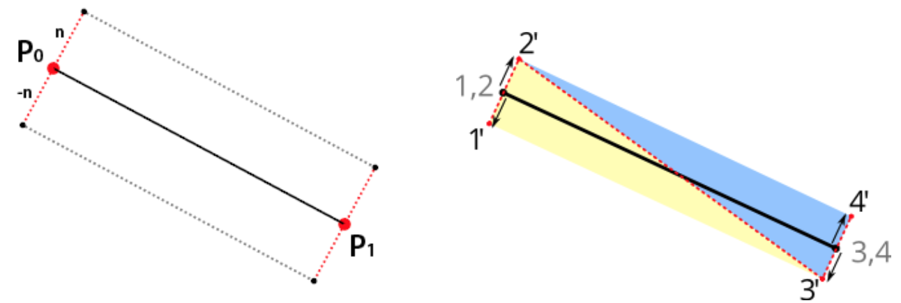
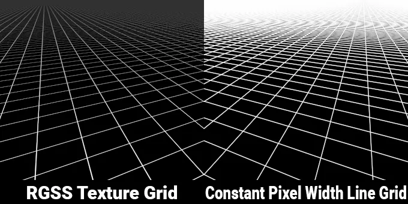

# Grid

Grids in canvas can be represented through straight lines or dots (or none).

## Line grid

Grid is not part of the scene graph. The grid should not scale up or down as the canvas is zoomed.

We will render the grid in the `beginFrame` hook:

```js
hooks.initAsync.tapPromise(async () => {
    this.#grid = new Grid();
});

hooks.beginFrame.tap(() => {
    this.#grid.render(
        this.#device,
        this.#renderPass,
        this.#uniformBuffer,
        camera
    );
});
```

There are also two approaches to rendering lines on the canvas.

## Line Geometry

The easiest approach is to create the lines based on the grid size. Vertices are added per line and then lines are drawn out.



Through this method, the larger the canvas size and the higher the density of the lines are, the more vertices are needed. This scaling makes this a less than ideal set up.

## Pattern in fragment shader

Rather than using vertex shaders to determine a bunch of vertices, we can instead take advantage of screen space, using only 4 vertices.

To draw the grids in the fragment shader, you need to know where in the world coordinate system you are at. You have to convert the coordinates from clip system to world system.

```glsl
layout(std140) uniform SceneUniforms {
    mat3 u_ProjectionMatrix;
    mat3 u_ViewMatrix;
    mat3 u_ViewProjectionInvMatrix;
};

out vec2 v_Position;

vec2 project_clipspace_to_world(vec2 p) {
    return (u_ViewProjectionInvMatrix * vec3(p, 1.0)).xy;
}

void main() {
    v_Position = project_clipspace_to_world(a_Position.xy);
}
```

By scaling up and using `fract`, you can create repeated patterns in fragment shaders.

To draw two separates types of grid, one coarse (for emphasis) and one fine grid, we need to check the pixel points.

We use the shader to determine if the line should be displayed and whether it should be a major line or a minor line.

## Texture-based grid



Texture grid ends up looking much better to the eye, while line grid creates a moire effect that distracts.

## Dot grid

Avoid using SDFs here, since that will require a lot of vertices.

Instead, use patterns here as well.
