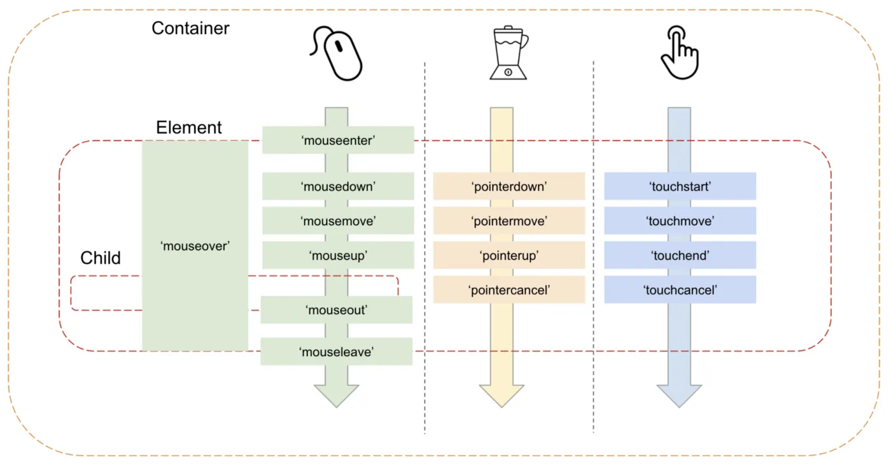

# Event System

We need more interactions than just with the camera position. We need to be able to interact with shapes etc. when dealing with the canvas.

## Event capturing and event bubbling
To extend the normal UI event, you need to understand event capturing and event bubbling. These two concepts are very similar but act in complete opposites of each other. An event stems from the element that the user interacts with, e.g. the button you press.

Event capturing and bubbling describe the directions that the events get propagated throughout the interaction tree.

Event capturing starts from the least nested element and moves towards the original targeted element. Event capture is disabled by default.

Event bubbling starts from the initial targeted element and 'bubbles' up towards the least nested element.

Both traversal would trigger the elements' events if there are any. Note that despite there being a formal second stage between event capturing and event bubbling, known as the target phase, this is not handled separately. The target element is still triggered during event capturing or event bubbling (or both!).

An event added to the capturing phase will not be triggered by the bubbling up after. You need to specifically add the event to each phase if you want them triggered during those phases:
```js
elem.addEventListener("click", e => alert(`Capturing: ${elem.tagName}`), true);
elem.addEventListener("click", e => alert(`Bubbling: ${elem.tagName}`));
```

`event.stopPropagation` during capturing phase will stop the event stream from continuing travelling, so it will block also any event from bubbling.

## PointerEvent
MouseEvents are separate from touchEvents, which caused an issue when mobile device became more prominent.

Then stylus was introduced, adding more event types and their own demands. PointerEvent was then proposed.



The implementation of canvas will aim to use PointerEvent.

### DOMEventListener plugin
Check if Pointer and Touch events are supported:
```ts
const supportsPointerEvents = !!globalThis.PointerEvent;
const supportsTouchEvents = 'ontouchstart' in globalThis;
```

Not all events can be attached to the canvas element. `PointerMove` must be bound to the window or document. 

### Adding listeners to shapes
Shapes should extend `EventEmitter`, which provides `on`, `once` and `off` methods. These will trigger interactions accordingly.

`on` means that a new event listener is created and its function will be triggered whenever the event is emitted by the emitter.

`once` means that a one-time listener function is attached for the event. When the event is triggered, the listener is removed and invoked.

`off` is the alias for `removeEventListener` and removes the listener altogether.

### Optimizing event allocation
Given that each pointer movement/gestures can fire off multiple events per second, creating a new event each time and dispatch it would lead to:
- Memory allocation: take up heap memory
- Object construction: initializing objects and its properties
- Placing the object onto the heap
- Create a pointer to refer to the object on the heap
- Eventual garbage collection phase where these dead objects are deallocated
- All JS execution is paused during garbage collection

This computing stacks up when faced with high interactive applications and will likely lead to lag.

Instead, the infinite canvas apporach uses **memory pool pattern** to reduce the overhead of creating objects and increase performance gain, in exchange for higher memory.

In this pattern, using this implementation as the example, a map is created to track the different event types and an array of the instances created of that kind.

Whenever an event of a specific is needed, the allocation system would find how many of those events is needed, pop them from the array and process them. Subsequently, they will return the event back to the array/pool.

As such, the events in the pool will be created as needed, resulting in a collection of pools at the height of its demand. None of the events will ever be garbage collected unless something higher up in the chain gets collected or the application stops.

It is possible to execute garbage collection manually to ensure that memory pool size is kept to a certain threshold, but that is not necessary in this instance.

Memory pool pattern is also applied when:
- Gaming: particles and bullets in bullet hell games are candidates for memory pooling since they are repeatedly 'created' on screen but only the max number of objects needed on screen will ever be created.
- UI elements: repeatively elements will also be recycled as needed
- Threading: you could identify the peak number of threads you need and work with that as your maximum number of threads and recycle as needed
- WebGL buffer pooling: the buffers will be reused if the right sized ones are available 

## Picking
To determine if a shape has been picked, you ust need to figure out if the point of picking is within graphic objects. An object picked should be added to the front of the list, being of higher layer (introducing z-index later will take care of rendering order).

```ts
export class Picker implements Plugin {
    private pick(result: PickingResult, root: Group) {
        const {
            position: { x, y },
        } = result;

        const picked: Shape[] = [];
        traverse(root, (shape: Shape) => {
            if (this.hitTest(shape, x, y)) {
                picked.unshift(shape);
            }
        });

        result.picked = picked;
        return result;
    }
}
```
However, this approach would require a start from the beginning root to traverse down each time. The cost would be quite significant. Optimization will be covered in the next chapter, but if I were to hazard a guess, I would think that you should simply have a list of affected nodes instead (keeping track maybe of the highest node in the hierachy).

### hitArea
Rather than specific nodes, we might want to target an area of a graphic isntead. We can introduce a `hitArea` instead.

### Exposing picking as an API
Picking elements should also be available for explicit calls.

## Drag and drop plugin
Native drag events have limitations, such as being unable to prevent dragging from certain areas. We also can't make the dragging horizontal or vertical only.

We can instead try to implement drag n drop through mouse events.

When implementating drag and drop to an object, you might be tempted to attach the event listener to the object itself for `pointerDown`, `pointerUp` and `pointerMove`. However, it is better to attach `pointerMove` to the document itself, rather than the object. This is because while `pointerMove` is triggered often, it is not triggered every pixel. Your pointer might be pointing somewhere in the document, and the object has lagged behind.

### Droppable
You would think that we can trigger droppable events by just hovering over them, but given that we aim to drag another object over the droppable, it would mean that the pointer event is already occupied with another object and it only happens to the top element.

We could use the method `document.elementFromPoint(clientX, clientY)`. It will return the topmost element if there is an overlap. We can detect droppable underneath by quickly hiding and unhiding the object we are dragging, allowing us to pick up what's underneath.

```js
// in a mouse event handler
draggable.hidden = true; // (*) hide the element that we drag

let elemBelow = document.elementFromPoint(event.clientX, event.clientY);
// elemBelow is the element below and may be droppable

draggable.hidden = false;
```
### Implementation
To decide that a dragging has started, we need the following:
- `dragstartDistanceThreshold` - only a certain distance above the thresholf would be considered a valid start
- `dragstartTimeThreshold` - if the drag has been active for longer than a certain period of time, the drag is a valid drag

## Modify camera control plugin

